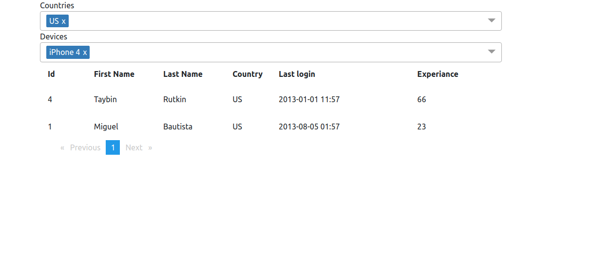

### How to run
To run application install docker and docker-compose. Then run 
`docker-compose up` and application will start in your browser on `localhost:4200`

###Technologies used in backend:
- Java 11
- Spring Boot 2.7.1
- JUnit 4
- PostgreSQL
- Liquibase

###Technologies used in frontend:
- Angular 14
- Bootstrap
-  Karma v6.3.20

Additionally, docker and docker-compose.

### TODO
- more backend and fronted tests
- countries table
- constraints/indexes
- split backend and frontend into separate repos
- docker network
- docker swarm/k8s
- clean up code and use versions of dependencies
